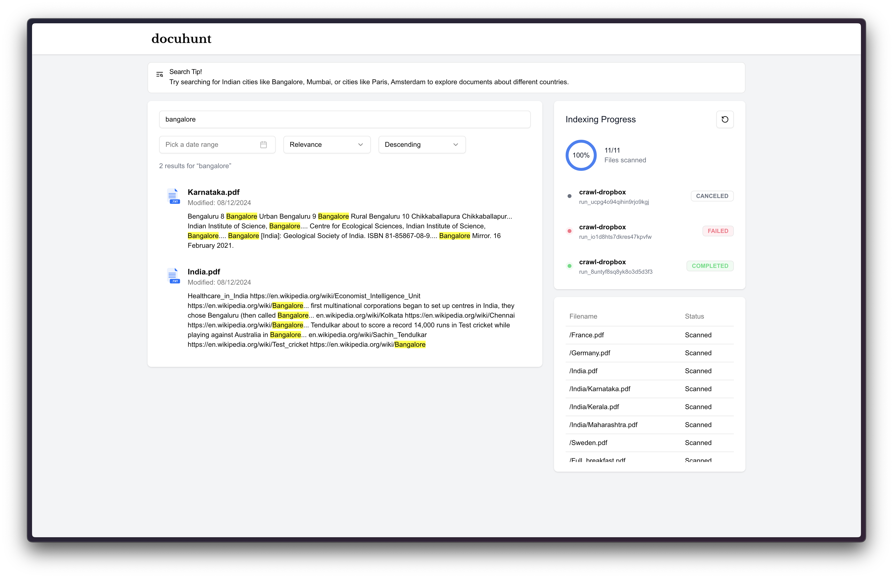
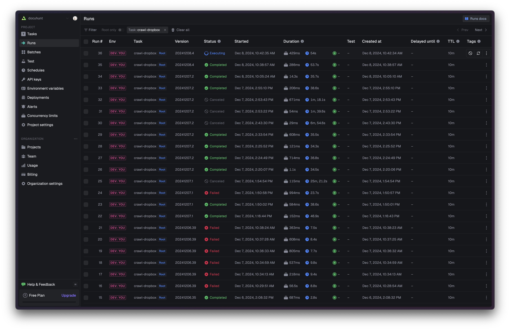

## Docuhunt



## Dropbox Setup

To use Docuhunt with Dropbox, you'll need to create a Dropbox app and configure the necessary credentials.

### 1. Create a Dropbox App

1. Go to the [Dropbox Developer Console](https://www.dropbox.com/developers)
2. Click "Create app"
3. Configure the app:
   - Choose "Scoped access" API
   - Select "Full Dropbox" access level
   - Name your app "docuhunt" (or your preferred name)

### 2. Configure OAuth Settings

In your app's settings, add the following Redirect URIs:

- `http://localhost:3000/` (for local development)
- `https://docuhunt.me/` (for production)

### 3. Set Required Permissions

Enable the following scopes:

- `files.metadata.write` - For accessing file metadata
- `files.content.read` - For reading file contents

### 4. Configure Environment Variables

Add the following credentials to your `.env` file:

```
DROPBOX_TOKEN=
DROPBOX_APP_KEY=
DROPBOX_APP_SECRET=
TRIGGER_SECRET_KEY=
ELASTICSEARCH_URL=
TIKA_URL=
REDIS_URL=
```

## Application Architecture

The application consists of several key components:

### API Routes

`/api/search` (POST)

- Handles search requests from the UI
- Accepts parameters:
  - query: Search text
  - startDate/endDate: Date range filters
  - sortBy: Sort by relevance or modified date
  - sortOrder: Ascending or descending
- Uses Elasticsearch client to search indexed documents
- Returns formatted results with highlights

### Background Processing (Trigger.dev)

`crawlDropboxTask`

- Workflow to crawl Dropbox files
- Process:
  1. Lists all files in Dropbox using Dropbox API
  2. For each supported file (txt, pdf, docx):
     - Downloads file content
     - Extracts text using Apache Tika for PDFs/DOCx
     - Indexes content in Elasticsearch
  3. Tracks processed files in Redis

### Data Flow

1. User uploads files to Dropbox
2. Trigger.dev runs crawl workflow periodically
3. Files are processed and indexed in Elasticsearch
4. UI sends search requests to /api/search
5. Results displayed with highlighted matches

### Storage

- Dropbox: Source document storage
- Elasticsearch: Indexed document content and metadata
- Redis: Processing state and file tracking

### Security

- Dropbox access via OAuth tokens

## Infrastructure (Terraform)

The infrastructure is deployed on AWS using Terraform and consists of:

- ECS Cluster running on Fargate
- Application Load Balancer (ALB) with HTTPS listener
- Two ECS Services:
  - Elasticsearch service (2 vCPU, 4GB RAM)
  - Apache Tika service (0.5 vCPU, 1GB RAM)
- Security Groups for ALB and ECS tasks

The ALB routes traffic based on host headers:

- elastic.docuhunt.me -> Elasticsearch service
- tika.docuhunt.me -> Tika service

All services run in the default VPC with public subnets and have auto-assigned public IPs for internet access.

## Tech Stack

### Infrastructure & Deployment

- Terraform - Infrastructure as Code
- AWS ECS - Container Orchestration
- AWS ALB - Load Balancing

### Backend Services

- Trigger.dev - Background Job Processing
- Elasticsearch - Document Search & Storage
- Apache Tika - Document Text Extraction
- Upstash Redis - Serverless Redis for State Management & Caching



### Frontend

- Next.js/React - Full-Stack React Framework
- TanStack React Query - Data Fetching & Caching
- Shadcn UI - Component Library
- Tailwind CSS - Styling

### Storage

- Dropbox - Document Storage

TODO:
[] Generate Dropbox Temporary Link
[] Generate token using refresh token
[x] Show list of files
[x] Advanced Filters
[] Disclaimer that it has been deployed in Mumbai, and show API latency and results
